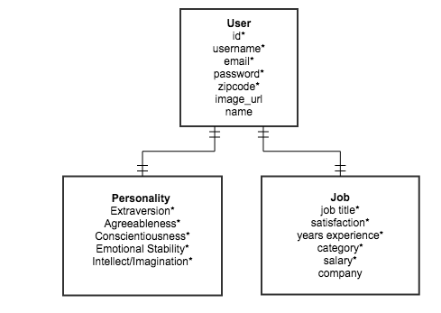

###Project 1 - Jobtions

###GA WDI DC November 2014 

**Overview**

Jobtions helps connect like-minded people to see what jobs they may be suited for.

[Jobtions](https://jobtions.herokuapp.com/)

**Technologies Used**

- Ruby 2.1.2
- PostgreSQL Database
- [MixItUp 2 (jQuery)](https://mixitup.kunkalabs.com/)
- [toastr 2.1.0 (jQuery)](https://github.com/CodeSeven/toastr)
- [Chart.js](http://www.chartjs.org/)
- [Faker gem for seeding the db](https://github.com/stympy/faker)
- [Fontello web fonts](http://fontello.com/)
- Adobe Illustrator

**User Stories Completed** 

- User can sign up / sign in 
- User can have a (linked) profile picture
- User can take a personality test to generate a unique personality score
- User can update profile information

**ERD**

**What's next?**
- Refactoring
- Background processing for similar users
- Overall scalability enhancements (MixItUp doesn't recommend more than 150 users on a page)
- Private messaging
- CRUD for company information (new table?)
- More CRUD options for accounts
- Better data validation
- More Styling 
- Testing

Set up
  
    rake db:create
    rake db:migrate
 